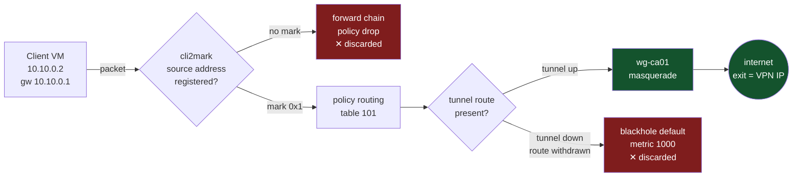
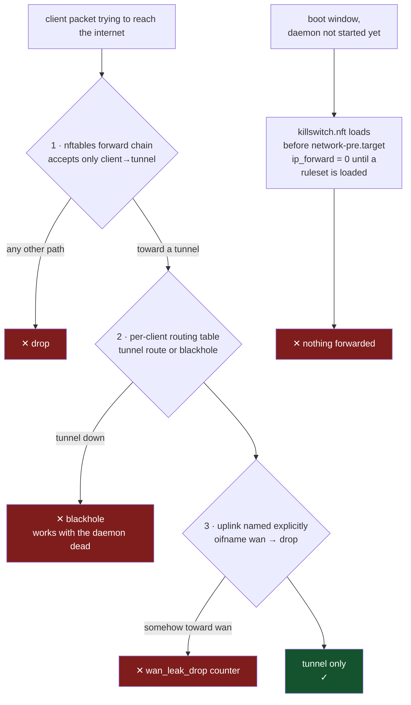
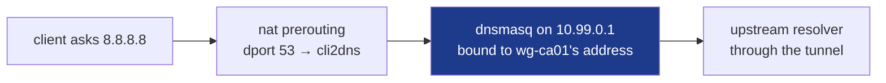

# vpngw

A fail-closed multi-VPN gateway for a Hyper-V lab. Each client VM is assigned
its own VPN exit — a specific tunnel, or a pool that fails over automatically —
and **no client packet can reach the internet except through a tunnel.**

Runs as a Debian 13 VM. Supports WireGuard and OpenVPN clients side by side,
against commercial providers and your own servers.

```
                    Hyper-V host (Windows)
   ┌───────────────────────────────────────────────────────┐
   │                                                       │
   │  Internal switch          Private switch              │
   │  (mgmt, 10.20.0.0/24)     (clients, 10.10.0.0/24)     │
   │        │                        │                     │
   │   ┌────┴────────────────────────┴──────┐              │
   │   │           vpngw  (Debian)          │              │
   │   │  mgmt0            br-lan ← lan0    │              │
   │   │                                    │              │
   │   │   wg-nl01  tun-us01  wg-de01 …     │              │
   │   │       └────────┴─────────┘         │              │
   │   │            wan0 ────────────────────────► internet│
   │   └────────────────────────────────────┘              │
   │                                                       │
   │   pc01 … pc10  ── static IPs, gateway 10.10.0.1       │
   └───────────────────────────────────────────────────────┘
```

## How it works

Three mechanisms carry the whole design. Everything else is bookkeeping.

### 1. One packet's journey

A client's packet is classified by its **source address**, marked, and routed
by its own table. The mark is the only way into a tunnel — and an unregistered
machine never gets one.



The blackhole route is the part that matters. When a tunnel dies the kernel
withdraws its routes by itself, leaving only the discard route — so clients
lose the internet **even if the vpngw daemon has crashed, been stopped, or
never started**. The kill switch does not depend on its own process being
alive.

### 2. Why nothing can leak

Independent layers, each of which survives the failure of the ones above it:



DNS gets the same treatment rather than trust: every `:53` packet from a
client is DNAT-ed to a resolver **bound to that client's own tunnel**, so a
machine hard-coding `8.8.8.8` is answered through its VPN anyway — queries
cannot name-leak past the tunnel.



### 3. Pools: failover with hysteresis

A client can point at a **pool** instead of one tunnel. Health probes with
hysteresis pick the member; failover moves every client on the pool at once,
and stickiness stops them flapping back.

```mermaid
stateDiagram-v2
    [*] --> Primary : pool eu = [ca01, nl01]
    Primary --> Failover : ca01 fails 3 probes
(hysteresis, not one loss)
    Failover --> Primary : operator moves it back
    Failover --> Blackhole : nl01 dies too
    Blackhole --> Failover : any member recovers
    Primary : traffic → ca01
    Failover : traffic → nl01
sticky - no flap-back
    Blackhole : no healthy member
clients blocked, not leaked
```

Measured on a live gateway: the exit IP moved `149.22.81.199 →
193.32.249.138` seventeen seconds after the primary was killed, and with every
member down the client was blocked — not handed to the uplink.

## What makes it different

Plenty of routers can send different clients through different VPNs. The part
that is usually missing — and the part this project is built around — is what
happens when a tunnel dies.

Most setups **fail open**: the tunnel's default route disappears, traffic falls
back to the main routing table, and clients quietly resume browsing from the
real uplink address. OpenWrt's `pbr` package
[documents that it does not support kill-switch mode](https://docs.openwrt.melmac.ca/pbr/).
OPNsense can be made to fail closed, but only by hand-ordering floating
firewall rules correctly and keeping them that way.

Here, failing closed is the shape of the system rather than a feature you
enable:

| Layer | Mechanism | Survives |
|---|---|---|
| Firewall | `forward` chain policy `drop`; forwarded traffic may only leave via `@tun_ifaces` | a wrong routing table |
| Routing | every policy table carries `blackhole default metric 1000` | **the daemon being dead** |
| Boot | ruleset loads `Before=network-pre.target` | a boot where vpngw never starts |
| Kernel | `net.ipv4.ip_forward = 0` until a ruleset is loaded | a broken upgrade |
| IPv6 | disabled on the client side entirely | a rogue router advertisement |
| Redirects | `send_redirects = 0` on every interface, not just `conf.all` | a client being told to route around the gateway |
| DNS | every `:53` query DNAT-ed to a per-tunnel resolver bound to that tunnel | a client hard-coding `8.8.8.8` |
| Proof | `vpngwctl selftest --disrupt` measures what escapes | wishful thinking |

The blackhole route is the important one. When a tunnel interface goes down the
kernel withdraws its routes automatically, leaving only the discard route — so
clients stop reaching the internet **even if vpngw has crashed, been stopped,
or was never started.** The kill switch does not depend on the kill switch's
own process being alive.

## Quick start

On the Windows host, in an elevated PowerShell:

```powershell
.\hyperv\New-VpnGwLab.ps1 -UplinkAdapter "Ethernet" -IsoPath D:\iso\debian-13-netinst.iso
```

Install Debian 13 (SSH server + standard utilities only — no desktop), then on
the VM:

```bash
sudo ./install.sh
```

The installer detects the layout, walks you through it, and refuses anything
that would leave the box unreachable. Set `VPNGW_NONINTERACTIVE=1` together
with `VPNGW_WAN` / `VPNGW_LAN` / `VPNGW_ADMIN_CIDR` to provision it without
prompts.

Then import a tunnel and point a client at it:

```bash
vpngwctl tunnel import nl01 ~/mullvad-nl.conf --name "Mullvad Amsterdam"
vpngwctl client add pc01 10.10.0.11 --egress tunnel:nl01
vpngwctl status
```

A pool that fails over between three tunnels, with clients on the pool rather
than on any one tunnel:

```bash
vpngwctl pool create eu --strategy priority --members nl01 de01 se01
vpngwctl client assign 10.10.0.12 pool:eu
```

## The panel

`http://10.20.0.1:8080` from the Windows host. The firewall accepts that port
only on the management interface, so clients cannot reach it at all.

| Page | What it is for |
|---|---|
| **Overview** | Kill-switch state, throughput graph, and a list of anything that needs attention — a pool with no healthy member, an unassigned client, a tunnel that dropped |
| **Tunnels** | Every tunnel with live latency, exit IP, throughput and a sparkline; click one for a detail drawer with graphs, endpoints and DNS |
| **Pools** | Failover chains drawn in priority order, with the currently active member highlighted |
| **Clients** | Assign a machine's exit from a dropdown, in place; multi-select for bulk reassignment |
| **Security** | Run the leak test and read the result check by check; firewall counters with what each one means; the generated ruleset itself |
| **Events** | Daemon events, filtered by level and text |
| **Settings** | Interfaces, client network, uplink addressing, DHCP and the panel password — no file editing required |

Changing the uplink is the one setting that can end the session changing it,
so it is applied the way network equipment has done it for decades: the new
configuration goes on with a rollback armed, and it only becomes permanent
when someone reaches the panel on the new address and confirms. Miss the
window and the old address comes back by itself — no console trip.

No build step and no external dependencies: one HTML file, one stylesheet, one
script, served off the gateway's own disk. A panel that needs a CDN is a panel
that breaks exactly when you are trying to work out why nothing can reach a CDN.

The panel is protected by a password (scrypt, in-memory sessions, rate
limited) on top of the firewall restriction. The first person to open a fresh
install is asked to set one.

Machines that appear on a client interface but are not registered are listed on
the Clients page with a one-click Register button. They are being dropped —
unknown means blocked — but a dropped machine otherwise looks exactly like one
that is switched off, which is a miserable thing to diagnose.

Everything the panel does is also a `vpngwctl` command, and the panel is
optional — the daemon runs fine with it never opened.

## Prove it works

```bash
vpngwctl selftest --disrupt
```

This attaches a network namespace to the client bridge as a real LAN client,
takes the tunnel down, generates traffic, and measures what escapes — using
both nftables counters and `tcpdump` on the uplink, which do not share a
failure mode. Sample output:

```
  PASS  tunnel carries traffic                      client exits as 185.65.134.66
  PASS  exit address is not the uplink's            exit 185.65.134.66, uplink 192.168.1.40
  PASS  no canary on the uplink while up            clean
  PASS  client with no egress cannot reach          blocked, unclassified_drop +7
  PASS  IPv6 cannot escape                          blocked
  PASS  hard-coded public DNS is intercepted        8.8.8.8 answered by the gateway's resolver
  PASS  kill switch is loaded before the network    ordered before network-pre.target and enabled
  PASS  the gateway does not teach clients to bypass  no interface sends ICMP redirects
  PASS  internet is unreachable while nl01 is down  blocked
  PASS  nothing reached the uplink (tcpdump)        0 packets on wan0
  PASS  routing table 101 fell back to blackhole    only the blackhole default remains

  RESULT: no leak found.
```

Until this passes on your box, treat the gateway as untested rather than
leak-proof.

Three more suites, all stdlib-only and runnable on the gateway itself:

```bash
tests/release_test.sh          # posture, boot ordering, and the leak test
tests/pool_test.sh             # kills pool members and measures the failover
tests/reboot_test.sh --before  # records state and reboots
tests/reboot_test.sh --after   # checks what came back, and what could not escape
```

The reboot suite is the one that catches what a running system cannot show
you: whether the box is fail-closed during the window *before* its own daemon
exists. It reads the boot journal to confirm the ruleset loaded ahead of the
network, and checks that nothing reached the uplink on the way up.

## Documentation

| | |
|---|---|
| [docs/killswitch.md](docs/killswitch.md) | How each layer works, and what it does **not** protect against |
| [docs/hyperv.md](docs/hyperv.md) | Switch topology, the three Hyper-V defaults that break routing VMs |
| [docs/operations.md](docs/operations.md) | Tunnels, pools, clients, DNS, troubleshooting |
| [docs/architecture.md](docs/architecture.md) | Marks, tables, the reconcile loop, why it is built this way |

## Layout

```
vpngw/            the daemon and CLI
  config.py       paths, mark/table allocation, settings
  models.py       tunnels, pools, clients, health
  db.py           sqlite, esid allocation
  reconciler.py   the single writer of kernel state
  render/
    nftables.py   the firewall generator - the security boundary
    openvpn.py    neutralises provider .ovpn directives
  tunnels/        wireguard and openvpn drivers
  health.py       liveness with hysteresis
  pools.py        member selection and failover
  dnsmgr.py       per-egress resolvers
  leaktest.py     the proof harness
  auth.py         panel password and sessions
  net/apply.py    uplink changes, with the rollback that makes them survivable
  api.py, web/    HTTP API and UI
hyperv/           PowerShell provisioning for the Windows side
debian/           sysctl and network configuration shipped to /etc
systemd/          unit files
scripts/          prepare-image.sh, for building a distributable disk
tests/            stdlib-only, runs on the gateway itself
```

## Requirements

Debian 13 (kernel 6.12, WireGuard in-tree), Python 3.11+, `nftables`,
`wireguard-tools`, `openvpn`, `dnsmasq-base`, `conntrack`, `tcpdump`.
`install.sh` handles all of it.

## Limits

Read [docs/killswitch.md](docs/killswitch.md#what-this-does-not-protect-against)
before relying on this. In short: it cannot help a client VM that has a second
network adapter on an External switch, and it does not defend the Hyper-V host
itself. Both are configuration discipline, not something a gateway can enforce.

## Distributing an image

`scripts/prepare-image.sh` strips a working gateway back to something safe to
hand to somebody else, and arms a first-boot service to regenerate what has to
be unique per machine:

```bash
sudo scripts/prepare-image.sh --dry-run   # lists what would go, changes nothing
sudo scripts/prepare-image.sh
sudo poweroff
```

It removes the database (tunnels, clients, pools, the admin password), the
secrets directory, the shell history, the logs — and the SSH host keys, which
are the ones that matter most. An image whose users all share a host key
cannot detect a man in the middle, and everybody who used the image before has
already trained themselves to click through the warning that would have shown
it. On first boot the new machine generates its own keys and machine ID, and
the panel asks for a password.

A `.vhdx` is the convenient option for Hyper-V, but it ages: the Debian
packages inside it are frozen at the day it was built. Installing from
`install.sh` on a current Debian is the version that stays correct.

## Licence

GPL-3.0-or-later. See [LICENSE](LICENSE).

This is a network security tool. It is offered without warranty of any kind:
run `tests/release_test.sh` and `vpngwctl selftest --disrupt` on your own
hardware and read the results before trusting it with anything that matters.
